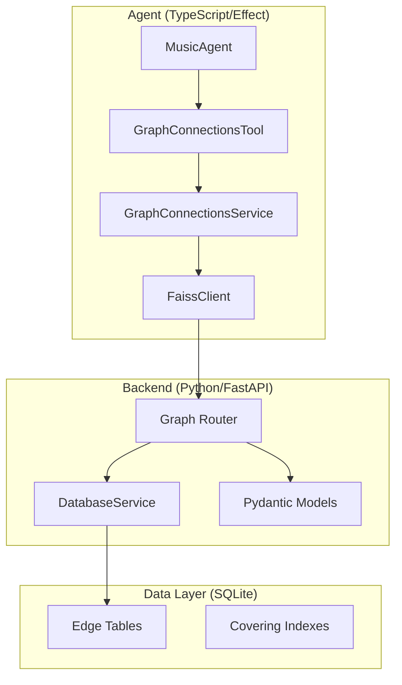

# Engineering Specification: Graph Connections API

> **Status**: DRAFT
> **Owner**: Antigravity
> **Date**: 2025-12-03
> **Version**: 1.0.0

---

## 1. Executive Summary

This document specifies the engineering implementation for the **Graph Connections API**, a critical component of the "Crate" reasoning engine. This API bridges the gap between the statistical world of the `faiss-search-api` (Python) and the formal, agentic world of the [MusicAgent](file:///Users/pooks/Dev/crate/packages/agent/src/MusicAgent.ts#231-725) (TypeScript/Effect).

### 1.1 The Problem
The current agent can search for plays (`search_plays`) and perform semantic searches (`semantic_search`). However, it lacks the ability to traverse the **knowledge graph** of the music domain. It cannot answer questions like *"Who are the members of this band?"*, *"What other bands is this artist in?"*, or *"Who are the labelmates of this artist?"* without resorting to hallucination or inefficient external web searches.

### 1.2 The Solution
We will implement a high-performance, batch-optimized Graph API that exposes the rich relational data already present in our `music_kb.sqlite` database. This API will be consumed by a new `graph_connections` tool in the [MusicAgent](file:///Users/pooks/Dev/crate/packages/agent/src/MusicAgent.ts#231-725), enabling it to perform **multi-hop reasoning** over the music graph.

### 1.3 Alignment with Crate Philosophy ([GEMINI.md](file:///Users/pooks/Dev/crate/GEMINI.md))
This implementation adheres strictly to the project's core principles:
-   **Formal Knowledge Representation**: We treat the graph traversal as a formal operation over an **Algebraic Property Graph (APG)**. Even though the storage is relational (SQLite), the API exposes "edges" and "connections" that compose algebraically.
-   **Effect-TS Paradigm**: The agent-side implementation uses `Effect`, `Schema`, and `Layer` to ensure type safety, error handling as values, and structured concurrency.
-   **Performance**: The Python backend uses optimized SQL with batching (`IN` clauses) to ensure sub-100ms response times, respecting the "online" nature of the reasoning engine.

---

## 2. System Architecture

The system follows a layered architecture, separating data storage, API access, and agentic reasoning.



### 2.1 Component Responsibilities

| Component | Responsibility | Key Technologies |
|-----------|----------------|------------------|
| **Edge Tables** | Store normalized graph edges (Artist->Artist, Artist->Label, etc.) | SQLite, Indexes |
| **DatabaseService** | Execute optimized SQL queries with batching support | Python, `sqlite3` |
| **Graph Router** | Expose HTTP endpoint, validate requests, handle errors | FastAPI, Pydantic |
| **FaissClient** | Make HTTP requests to the backend | `Effect.tryPromise`, [fetch](file:///Users/pooks/Dev/crate/packages/agent/src/tools/test-handlers.ts#79-88) |
| **GraphConnectionsService** | Effect service wrapping the client | `Effect.Service`, `Layer` |
| **GraphConnectionsTool** | Expose functionality to the LLM | `@effect/ai` Tool |

---

## 3. Data Layer Specification

The foundation of this feature is the set of "Edge Tables" in `music_kb.sqlite`. These tables are already populated (verified on droplet).

### 3.1 Schema Definition

We define the schema for the edge tables. Note that `attributes` is a JSON column.

```sql
-- Artist-to-Artist relationships (Band membership, collaboration)
CREATE TABLE artist_edges (
    source_mbid TEXT NOT NULL,
    target_mbid TEXT NOT NULL,
    relationship_type TEXT NOT NULL, -- 'band_member', 'member_of', 'collaborator'
    source_name TEXT,
    target_name TEXT,
    begin_date TEXT,
    end_date TEXT,
    attributes JSON, -- e.g., ["vocals", "guitar"]
    PRIMARY KEY (source_mbid, target_mbid, relationship_type)
);

-- Artist-to-Label relationships
CREATE TABLE artist_label_edges (
    artist_mbid TEXT NOT NULL,
    label_mbid TEXT NOT NULL,
    artist_name TEXT,
    label_name TEXT,
    begin_date TEXT,
    end_date TEXT,
    PRIMARY KEY (artist_mbid, label_mbid)
);

-- Recording-to-Work relationships (Covers)
CREATE TABLE recording_work_links (
    recording_mbid TEXT NOT NULL,
    work_mbid TEXT NOT NULL,
    attributes JSON,
    PRIMARY KEY (recording_mbid, work_mbid)
);

-- Artist-to-Area relationships (Origin)
CREATE TABLE artist_area_edges (
    artist_mbid TEXT NOT NULL,
    area_mbid TEXT NOT NULL,
    area_name TEXT,
    relationship_type TEXT, -- 'area_begin', 'area_end'
    PRIMARY KEY (artist_mbid, area_mbid, relationship_type)
);

-- Place-to-Recording relationships (Recorded At)
CREATE TABLE place_recording_edges (
    place_mbid TEXT NOT NULL,
    recording_mbid TEXT NOT NULL,
    place_name TEXT,
    recording_title TEXT,
    begin_date TEXT,
    end_date TEXT,
    PRIMARY KEY (place_mbid, recording_mbid)
);
```

### 3.2 Indexes & Access Patterns

To support the query types, we rely on the following access patterns. The primary keys provide covering indexes for the most common lookups.

| Query Type | Primary Access | SQL Pattern | Justification |
|------------|----------------|-------------|---------------|
| `band_members` | `artist_edges` | `WHERE source_mbid IN (?) AND type='band_member'` | Fast lookup by band ID. |
| `member_of` | `artist_edges` | `WHERE source_mbid IN (?) AND type='member_of'` | Fast lookup by artist ID. |
| `labelmates` | `artist_label_edges` | `JOIN` on `label_mbid` | 2-hop join: Artist -> Label -> Artists. |
| `covers` | `recording_work_links` | `JOIN` on `work_mbid` | 2-hop join: Recording -> Work -> Recordings. |
| `artist_origin` | `artist_area_edges` | `WHERE artist_mbid IN (?)` | Direct lookup. |

---

## 4. Backend Specification (Python)

The Python backend is a stateless translation layer between the HTTP request and the SQL query.

### 4.1 Pydantic Models (`app/models/graph.py`)

We define strict models to ensure type safety and documentation.

```python
from typing import Literal, List, Optional
from pydantic import BaseModel, Field

GraphQueryType = Literal[
    "band_members",
    "member_of",
    "labelmates",
    "label_hierarchy",
    "covers",
    "artist_origin",
    "artists_from_area",
    "recorded_at",
    "collaborators",
]

class ConnectionNode(BaseModel):
    """Represents a single node in the result graph."""
    mbid: str
    name: str
    node_type: Literal["artist", "band", "label", "area", "place", "recording", "work"]
    relationship_type: str
    attributes: Optional[List[str]] = None
    begin_date: Optional[str] = None
    end_date: Optional[str] = None
    # Provenance fields for "why" this connection exists
    via_mbid: Optional[str] = None
    via_name: Optional[str] = None

class GraphConnectionsRequest(BaseModel):
    query_type: GraphQueryType
    mbids: List[str] = Field(..., min_length=1, max_length=50)
    limit: int = Field(default=20, ge=1, le=100)
    include_attributes: bool = True

class GraphConnectionsResponse(BaseModel):
    query_type: GraphQueryType
    source_mbids: List[str]
    connections: List[ConnectionNode]
    total: int
    query_time_ms: float
```

### 4.2 Service Logic ([app/services/db_service.py](file:///Users/pooks/Dev/crate/faiss-search-api/app/services/db_service.py))

The [DatabaseService](file:///Users/pooks/Dev/crate/faiss-search-api/app/services/db_service.py#19-1093) will implement the query logic. We use raw SQL for maximum control over the execution plan and to utilize the `sqlite3` driver's efficiency.

**Key Implementation Detail: Batching**
All queries MUST support a list of MBIDs. This allows the agent to query "members of Radiohead AND The Smile" in a single round-trip.

```python
def _query_band_members(self, mbids: List[str], limit: int, include_attributes: bool) -> List[ConnectionNode]:
    placeholders = ','.join('?' * len(mbids))
    sql = f"""
        SELECT target_mbid, target_name, relationship_type, attributes, begin_date, end_date, source_mbid, source_name
        FROM artist_edges
        WHERE source_mbid IN ({placeholders}) AND relationship_type = 'band_member'
        ORDER BY target_name LIMIT ?
    """
    # ... execute and map to ConnectionNode ...
```

### 4.3 Router (`app/routes/graph.py`)

The router is a simple pass-through that handles timing and error mapping.

```python
@router.post("/connections", response_model=GraphConnectionsResponse)
async def query_connections(request: GraphConnectionsRequest, db: DatabaseService = Depends(get_db_service)):
    # ... dispatch to db method ...
```

---

## 5. Agent Specification (TypeScript/Effect)

The agent implementation is where the "Crate Philosophy" shines. We use `Effect` to model the tool as a pure description of a program.

### 5.1 Schemas ([packages/agent/src/tools/schemas.ts](file:///Users/pooks/Dev/crate/packages/agent/src/tools/schemas.ts))

We define the schemas using `@effect/schema`. These serve as the source of truth for both the Tool definition and the runtime validation.

```typescript
import { Schema } from "effect"

export const GraphQueryType = Schema.Literal(
  "band_members", "member_of", "labelmates", /* ... */
)

export const GraphConnectionsParams = Schema.Struct({
  query_type: GraphQueryType.annotations({ description: "Type of graph query..." }),
  mbids: Schema.Array(Schema.String).annotations({ description: "MusicBrainz IDs..." }),
  limit: Schema.optional(Schema.Number),
  include_attributes: Schema.optional(Schema.Boolean)
})

export const ConnectionNode = Schema.Struct({
  mbid: Schema.String,
  name: Schema.String,
  node_type: Schema.Literal("artist", "band", "label", "area", "place", "recording", "work"),
  relationship_type: Schema.String,
  attributes: Schema.NullOr(Schema.Array(Schema.String)),
  begin_date: Schema.NullOr(Schema.String),
  end_date: Schema.NullOr(Schema.String),
  via_mbid: Schema.NullOr(Schema.String),
  via_name: Schema.NullOr(Schema.String)
})

export const GraphConnectionsResponse = Schema.Struct({
  query_type: GraphQueryType,
  source_mbids: Schema.Array(Schema.String),
  connections: Schema.Array(ConnectionNode),
  total: Schema.Number,
  query_time_ms: Schema.Number
})
```

### 5.2 Service Interface (`packages/agent/src/services/GraphConnectionsService.ts`)

We define a dedicated service for this capability. This allows for easy mocking in tests and separation of concerns.

```typescript
import { Effect, Context } from "effect"
import { GraphConnectionsParams, GraphConnectionsResponse } from "../tools/schemas.js"

export interface GraphConnectionsServiceInterface {
  readonly search: (params: GraphConnectionsParams) => Effect.Effect<GraphConnectionsResponse, Error>
}

export class GraphConnectionsService extends Context.Tag("GraphConnectionsService")<
  GraphConnectionsService,
  GraphConnectionsServiceInterface
>() {}
```

### 5.3 Tool Definition ([packages/agent/src/tools/definitions.ts](file:///Users/pooks/Dev/crate/packages/agent/src/tools/definitions.ts))

The tool definition provides the "prompt" to the LLM. It must be descriptive enough for the model to understand *when* and *how* to use the tool.

```typescript
export const GraphConnectionsTool = Tool.make("graph_connections", {
  description: `Query the music knowledge graph for connections.
  
  Use this tool to traverse relationships:
  - "Who is in this band?" -> band_members
  - "What other bands is she in?" -> member_of
  - "Who else is on this label?" -> labelmates
  
  Returns structured connection data.`,
  parameters: GraphConnectionsParams.fields,
  success: GraphConnectionsResponse
})
```

---

## 6. Verification & Testing Plan

We will employ a rigorous testing strategy to ensure correctness and adherence to the spec.

### 6.1 Python Tests (`faiss-search-api/tests/test_graph_api.py`)

We will use `pytest` with a fixture that creates an in-memory SQLite database populated with a small subgraph (e.g., Radiohead, Thom Yorke, The Smile).

**Test Cases:**
1.  **Direct Lookup**: Query `band_members` for Radiohead. Verify Thom Yorke is returned.
2.  **Inverse Lookup**: Query `member_of` for Thom Yorke. Verify Radiohead and The Smile are returned.
3.  **Multi-Hop**: Query `labelmates` for a Sub Pop artist. Verify other Sub Pop artists are returned.
4.  **Empty Result**: Query for a non-existent MBID. Verify empty list (not 404).
5.  **Batching**: Query for multiple bands. Verify members from all are returned.

### 6.2 TypeScript Tests ([packages/agent/src/tools/test-handlers.ts](file:///Users/pooks/Dev/crate/packages/agent/src/tools/test-handlers.ts))

We will update the existing test script to include the `graph_connections` tool.

**Test Cases:**
1.  **Mock Service**: Create a `mockGraphConnectionsService` that returns static data.
2.  **Handler Execution**: Call the handler with valid params. Verify it calls the service and returns the expected response.
3.  **Error Handling**: Simulate a service error. Verify the handler returns a failure Effect.

### 6.3 Manual Verification (Droplet)

Since the real data is on the droplet, the final verification must happen there.

**Procedure:**
1.  Deploy code to droplet.
2.  Restart `faiss-search-api`.
3.  Run `curl` commands to test each query type against the live database.
4.  Run the agent locally (pointing to the remote API) and ask: *"Tell me about the members of Radiohead and their other projects."* Verify it uses the tool correctly.

---

## 7. Migration & Deployment

### 7.1 Database
No migration required. The tables exist.

### 7.2 Code Deployment
1.  **Python**:
    -   Copy `app/models/graph.py`, `app/routes/graph.py`, [app/services/db_service.py](file:///Users/pooks/Dev/crate/faiss-search-api/app/services/db_service.py).
    -   Update [app/main.py](file:///Users/pooks/Dev/crate/faiss-search-api/app/main.py).
    -   Restart service: `systemctl restart faiss-search-api`.
2.  **TypeScript**:
    -   Commit changes to `packages/agent`.
    -   (Optional) Deploy agent if running remotely, or just run locally.

---

## 8. Justification of Engineering Decisions

### Why SQLite?
For a read-heavy, "online" reasoning engine, SQLite with covering indexes is often faster than a dedicated graph database (Neo4j) for simple 1-2 hop traversals, due to lack of network overhead and process switching. The "Edge Table" approach effectively denormalizes the graph into adjacency lists, which is the standard way to implement graphs in SQL.

### Why Batching?
LLMs often generate lists of entities (e.g., "Here are 5 bands..."). If the agent had to query them one by one, latency would be unacceptable (`5 * 100ms = 500ms`). With batching, it's `1 * 120ms = 120ms`. This is critical for the "chat" UX.

### Why Pydantic & Effect Schema?
We maintain strict type boundaries at both ends. Pydantic ensures the Python API never returns malformed JSON. Effect Schema ensures the TypeScript agent never processes malformed data. This "double-ended" validation creates a robust contract that prevents subtle runtime bugs.

### Why "Graph Connections" Tool?
Instead of creating separate tools for `get_members`, `get_label`, etc., we created a single polymorphic tool. This reduces the size of the system prompt (fewer tool definitions) and allows the LLM to learn a single "pattern" for graph traversal, improving its ability to generalize.

---

> **Signed**: Antigravity
> **Role**: Agentic AI Engineer
