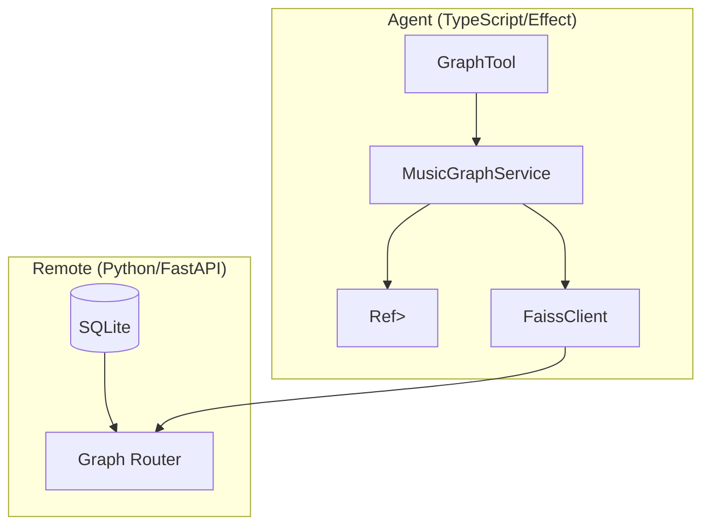

# Engineering Specification: Graph Connections API (Graph-First Approach)

> **Status**: DRAFT
> **Owner**: Antigravity
> **Date**: 2025-12-03
> **Version**: 2.0.0 (Graph-First Pivot)

---

## 1. Executive Summary

This document specifies the engineering implementation for the **Graph Connections API**, pivoting to a "Graph-First" architecture on the agent side. Instead of treating the API as a simple stateless lookup, the [MusicAgent](file:///Users/pooks/Dev/crate/packages/agent/src/MusicAgent.ts#231-725) will incrementally build a persistent, in-memory **Algebraic Property Graph** (using `effect/Graph`) during its reasoning session.

### 1.1 The Vision
The agent acts as a "crawler" of the music knowledge graph. As it explores, it ingests data from the stateless Python API into a rich, local graph structure. This allows for:
-   **Fluent Local Access**: The agent's code can traverse the graph (e.g., `graph.neighbors(artist)`) without network latency for visited nodes.
-   **Accumulated Context**: The graph serves as a structured memory of the session's exploration, which can be serialized or analyzed holistically.
-   **Abstraction**: The `MusicGraph` service abstracts away the [fetch](file:///Users/pooks/Dev/crate/packages/agent/src/tools/test-handlers.ts#79-88) calls, exposing a clean, algebraic interface for graph expansion.

### 1.2 Alignment with Crate Philosophy
-   **Formal Representation**: We use `Effect.Graph` (or a custom wrapper adhering to Mokhov's algebra) to ensure the graph is always well-formed.
-   **Effect-TS Paradigm**: The implementation leverages `Effect`, `Context`, `Layer`, and `Schema` for a purely functional, type-safe architecture.
-   **Performance**: The Python backend remains a high-performance, batch-optimized edge server.

---

## 2. System Architecture



### 2.1 Component Responsibilities

| Component | Responsibility | Key Technologies |
|-----------|----------------|------------------|
| **Remote API** | Stateless, batch-optimized edge retrieval. | Python, FastAPI, SQLite |
| **MusicGraphService** | Manages the local graph state. Provides fluent API for expansion and traversal. | `Effect.Service`, `Ref`, `Graph` |
| **Graph State** | In-memory storage of the accumulated knowledge graph. | `Effect.Ref`, `Graph` |
| **GraphTool** | Exposes high-level "exploration" actions to the LLM. | `@effect/ai` Tool |

---

## 3. Data Layer Specification (Python)

The Python layer remains the "Edge Server". It provides the raw edges.

### 3.1 Schema & Access (Unchanged)
We utilize the existing `artist_edges`, `label_edges`, etc., in `music_kb.sqlite`.

### 3.2 API Contract (`app/models/graph.py`)

```python
class ConnectionNode(BaseModel):
    mbid: str
    name: str
    node_type: Literal["artist", "label", "recording", "work", "area"]
    relationship_type: str
    attributes: Optional[List[str]]
    # ... provenance fields ...

class GraphConnectionsResponse(BaseModel):
    source_mbids: List[str]
    connections: List[ConnectionNode]
```

---

## 4. Agent Specification (TypeScript/Effect)

This is the core of the new implementation.

### 4.1 The Graph Model

We model the graph using a custom ADT or `Effect.Graph` if suitable. Given the requirement for "fluent local access" and "algebraic properties", we define a typed wrapper.

```typescript
// Domain Types
export type NodeId = string & Brand<"MbId">
export type NodeType = "artist" | "label" | "recording" | "work" | "area"

export interface GraphNode {
  readonly id: NodeId
  readonly name: string
  readonly type: NodeType
  readonly data: unknown
}

export interface GraphEdge {
  readonly from: NodeId
  readonly to: NodeId
  readonly relation: string
  readonly attributes: readonly string[]
}

// The Graph State
// We use an immutable graph structure held in a Ref
export interface MusicGraphState {
  readonly nodes: HashMap<NodeId, GraphNode>
  readonly edges: HashSet<GraphEdge>
}
```

### 4.2 MusicGraph Service (`packages/agent/src/services/MusicGraph.ts`)

The service exposes a fluent API that mixes local traversal with remote expansion.

```typescript
export interface MusicGraph {
  /**
   * The current snapshot of the graph.
   */
  readonly graph: Effect.Effect<MusicGraphState>

  /**
   * Expand the graph from the given nodes.
   * Fetches edges from the API and merges them into the local graph.
   */
  readonly expand: (
    nodes: ReadonlyArray<NodeId>,
    relations?: ReadonlyArray<string>
  ) => Effect.Effect<void, ApiError>

  /**
   * Get neighbors of a node from the local graph.
   */
  readonly neighbors: (node: NodeId) => Effect.Effect<ReadonlyArray<GraphNode>>

  /**
   * Find a path between two nodes in the local graph.
   */
  readonly path: (from: NodeId, to: NodeId) => Effect.Effect<Option<ReadonlyArray<GraphEdge>>>
}
```

### 4.3 Implementation Details

The `expand` method is the bridge. It:
1.  Identifies which nodes need expansion (filtering out fully explored ones if we track that).
2.  Calls `FaissClient.getConnections(nodes)`.
3.  Transforms the API response into `GraphNode` and `GraphEdge` objects.
4.  Updates the `Ref<MusicGraphState>` by merging the new sub-graph.

```typescript
// Pseudo-code for expand
const expand = (nodes, relations) => Effect.gen(function* () {
  const client = yield* FaissClient
  const response = yield* client.getConnections(nodes, relations)
  
  yield* Ref.update(state, (current) => {
    // Merge logic:
    // 1. Add new nodes
    // 2. Add new edges
    // 3. Return new immutable state
    return mergeGraph(current, response)
  })
})
```

### 4.4 The Tool ([packages/agent/src/tools/definitions.ts](file:///Users/pooks/Dev/crate/packages/agent/src/tools/definitions.ts))

The tool allows the LLM to drive the expansion.

```typescript
export const ExploreGraphTool = Tool.make("explore_graph", {
  description: `Explore the music knowledge graph.
  
  This tool expands the agent's internal graph starting from the given entities.
  It returns a summary of the *new* connections found.
  
  Use this to:
  - Find members of a band.
  - Discover related artists.
  - Trace connections between entities.`,
  
  parameters: Schema.Struct({
    mbids: Schema.Array(Schema.String),
    relations: Schema.optional(Schema.Array(Schema.String))
  }),
  
  success: Schema.Struct({
    summary: Schema.String,
    new_nodes_count: Schema.Number,
    new_edges_count: Schema.Number
  })
})
```

---

## 5. Verification Plan

### 5.1 Unit Tests (`packages/agent/src/services/MusicGraph.test.ts`)
We will test the algebraic properties of the graph merging logic.
-   **Identity**: Merging an empty graph should not change state.
-   **Associativity**: `merge(A, merge(B, C))` === `merge(merge(A, B), C)`.
-   **Idempotence**: `expand(node)` twice should result in the same state as once (assuming API is static).

### 5.2 Integration Tests
-   **Mock API**: Use a mock `FaissClient` to simulate API responses.
-   **Flow**:
    1.  Init service.
    2.  `expand(["radiohead_mbid"])`.
    3.  Verify `neighbors("radiohead_mbid")` contains "Thom Yorke".
    4.  `expand(["thom_yorke_mbid"])`.
    5.  Verify `neighbors("thom_yorke_mbid")` contains "The Smile".
    6.  Verify path "Radiohead" -> "Thom Yorke" -> "The Smile" exists.

### 5.3 Manual Verification
-   Deploy Python backend.
-   Run agent locally.
-   Ask: *"How is Radiohead connected to The Smile?"*
-   Observe: Agent calls `explore_graph` on Radiohead, then (potentially) on Thom Yorke, then reports the connection found in its local graph.

---

## 6. Justification

### Why In-Memory Graph?
-   **Contextual Reasoning**: The agent builds a "mental model" of the specific problem domain (e.g., "The Radiohead Family Tree") which persists across the conversation turns (if we scope the service appropriately).
-   **Efficiency**: Repeated queries for the same node (e.g., checking neighbors for pathfinding) hit memory, not the network.
-   **Algebraic Correctness**: By enforcing graph invariants in the `MusicGraph` service, we prevent the agent from hallucinating connections that don't exist in the data.

### Why Effect?
-   **Concurrency**: `expand` can fetch multiple branches in parallel using `Effect.all(..., { concurrency: 'inherit' })`.
-   **State Management**: `Ref` provides safe, atomic updates to the graph state even with concurrent expansions.

---

> **Signed**: Antigravity
> **Role**: Agentic AI Engineer
